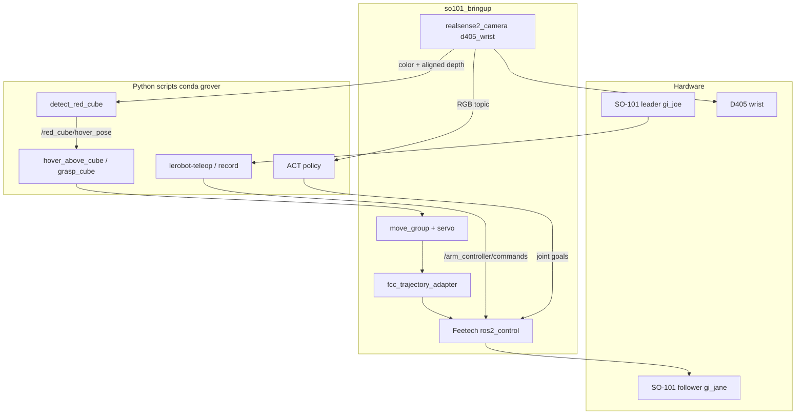

# grover_ws

ROS 2 Jazzy workspace for a **SO-101** follower arm (`gi_jane`) with a wrist-mounted Intel RealSense **D405**, a **SO-101 leader** (`gi_joe`) for teleop, **MoveIt 2**, and **LeRobot ACT** for “pick up the cube.”

The robot is commanded in **joint position** through `ros2_control` (`ForwardCommandController`). Imitation uses wrist **RGB** (640×480 @ 30 Hz) plus joint state — not depth. Depth is used only for cube detection / hover.

On hardware, the hover → ACT → home pipeline succeeded on **8 / 10** timed trials (**80%**). Further demos were consistent with that rate.
<p align="center">
  <video src="https://github.com/user-attachments/assets/f4cfbf77-6e72-4871-8430-97143479af3c"></video>
</p>

## Who this is for

This repo is for people putting a **SO-101 on ROS 2 Jazzy with a wrist D405** and wanting a path from teleop demos to a closed-loop pick — not a generic LeRobot tutorial and not a stock SO-101 URDF.

Typical readers:

- **SO-101 owners** who want MoveIt, `ros2_control`, and a wrist camera in one bringup instead of stitching Hugging Face LeRobot USB control to a separate ROS stack.
- **Imitation / ACT users** who need the camera to live in ROS for detection and planning, then feed the **same** wrist RGB into LeRobot without opening the D405 twice.
- **Anyone mounting a D405 on the SO-101 wrist.** Public SO-101 models generally stop at the gripper. This tree includes the printed holder mesh, inertial estimate (holder + camera), and hand-eye TF from `gripper` to `d405_wrist_color_optical_frame`. That description was rolled here because nothing equivalent turned up off the shelf.
- **Jazzy + Feetech users** hitting `JointTrajectoryController` issues: MoveIt still Plan & Executes because a small adapter turns FollowJointTrajectory into FCC `Float64MultiArray` commands.

You get less value if you only need stock `lerobot-teleop` on the Feetech bus with no ROS, or a different arm/camera.

## What is actually novel here

Pieces that are specific to this workspace, not copies of upstream SO-101 / LeRobot / RealSense demos:

- **SO-101 + D405 URDF** — `Wrist_Roll_D405_Holder.stl` on the gripper link, mass/inertia for PLA holder + D405 body, optional URDF optical frames vs a calibrated static TF (`camera_pose.launch.py`). Hand-eye assets live under `config/realsense-d405/`.
- **One launch, two camera owners** — `enable_d405:=true` for detect/hover/ACT (ROS node); `false` for record/eval (LeRobot `intelrealsense`). Documented because USB cannot be shared; mixing them fails with `VIDIOC_S_FMT`.
- **ACT while ROS keeps the camera** — `scripts/ros_image_camera.py` is a LeRobot `Camera` that subscribes to `/d405_wrist/color/image_raw` (SensorData QoS) so policy inference does not steal the device from `realsense2_camera`.
- **QoS that actually streams** — D405 color/depth default to Reliable + history 1, which stalls Python Best Effort subscribers after 1–2 frames. Bringup sets `color_qos` / `depth_qos` to `SENSOR_DATA`.
- **FCC trajectory adapter** — JTC on this Feetech + Jazzy setup is not used for execution; `fcc_trajectory_adapter` is the MoveIt ↔ hardware bridge.
- **Detect → hover → ACT → home** — HSV + aligned depth publishes `/red_cube/hover_pose`; MoveIt parks with wrist-roll/flex holds; ACT runs ~12 s; then `home`. `grasp_cube.py` loops that with a live Qt view (conda OpenCV is headless, so no `imshow`).
- **Gripper outside the MoveIt `arm` group** — named pose YAML still commands `gripper_joint` on `/gripper_controller/commands`.
- **Conda LeRobot + sourced Jazzy** — scripts preload conda OpenSSL 3.3 so `_ssl`/torch work after ROS puts Ubuntu 3.0 `libcrypto` on `LD_LIBRARY_PATH`; one rclpy context for the grasp loop so Jazzy does not hit `Context.init() must only be called once`.

The ACT policy itself is stock LeRobot ACT on RGB + joints. The integration around it (description, bringup, camera split, hover, QoS, FCC) is the reusable part.

## Hardware

| Role | Name | Notes |
|------|------|--------|
| Follower | `gi_jane` | Feetech STS3215 bus on `/dev/so101_follower` |
| Leader | `gi_joe` | `/dev/so101_leader` |
| Wrist camera | D405 | USB 3.x; serial used in this setup: `353322271703` |

Do not run **leader teleop** and **RViz Plan & Execute** (or `grasp_cube.py` / hover) at the same time — both write arm/gripper commands.

## Architecture



**Camera ownership (important):** the D405 USB device can be opened by only one process.

| Mode | Bringup | Who opens the D405 |
|------|---------|---------------------|
| Detect / hover / `grasp_cube.py` | `enable_d405:=true` | ROS `realsense2_camera` |
| Record / eval teleop | `enable_d405:=false` | LeRobot `intelrealsense` |
| Train ACT | Camera not needed | — |

Wrist RGB for ACT after hover comes from `/d405_wrist/color/image_raw` (`scripts/ros_image_camera.py`), not a second USB open. Color/depth publishers use **SensorData / Best Effort** QoS so Python subscribers do not stall after a couple of frames.

**Packages** (under `src/`):

- `lerobot_description` — URDF/xacro, D405 mount, Gazebo/RViz
- `lerobot_controller` — `ros2_control` configs, FCC trajectory adapter (MoveIt FollowJointTrajectory → `Float64MultiArray`)
- `lerobot_moveit` — MoveIt 2 + optional octomap from the wrist cloud
- `lerobot-ros` — LeRobot robot type `so101_ros` (`ActionType.JOINT_POSITION`)

Workspace scripts live in `scripts/`. Named joint poses are YAML in `config/poses/`. Datasets and checkpoints go under `outputs/` (gitignored).

## Setup

1. **OS / ROS:** Ubuntu 24.04, ROS 2 Jazzy, MoveIt 2, `realsense2_camera`, Feetech `ros2_control` hardware plugin.

2. **Workspace:**

   ```bash
   cd ~/GitHub/grover_ws
   # optional: vcs import src < grover.repos
   source /opt/ros/jazzy/setup.bash
   colcon build --symlink-install
   source install/setup.bash
   ```

   `colcon_defaults.yaml` skips building `librealsense2` from `src/`.

3. **Conda `grover`:** LeRobot **0.5.1**, PyTorch, OpenCV (this env’s `cv2` is **headless** — camera windows use Qt via `scripts/view_ros_image.py`). Activate it for all `python3 scripts/…` commands.

   Sourcing ROS puts Ubuntu OpenSSL 3.0 on `LD_LIBRARY_PATH`. Scripts that import torch after `rclpy` preload conda’s `libssl`/`libcrypto` so `_ssl` can find `OPENSSL_3.3.0`.

4. **Devices:** follower and leader should appear as `/dev/so101_follower` and `/dev/so101_leader`. Bringup runs `scripts/configure_so101_follower_bus.py` on the follower before `ros2_control` opens the port.

5. **Hand-eye (optional):** print `config/realsense-d405/charuco.png` at 1:1 (28 mm squares). See `config/realsense-d405/README.md`. Bringup uses `config/realsense-d405/camera_pose.launch.py` for `gripper` → `d405_wrist_color_optical_frame`.

## How to run

Always `source /opt/ros/jazzy/setup.bash`, `source install/setup.bash`, and `conda activate grover`.

### 1. Bringup

**Cube detect / hover / ACT** (ROS owns the D405):

```bash
ros2 launch launch/so101_bringup.launch.py is_sim:=False enable_d405:=true enable_octomap:=false
```

**Record or LeRobot eval** (LeRobot owns the D405):

```bash
ros2 launch launch/so101_bringup.launch.py is_sim:=False enable_d405:=false enable_octomap:=false
```

Simulation (default `is_sim:=True`):

```bash
ros2 launch launch/so101_bringup.launch.py
```

Useful args: `follower_serial_port`, `enable_octomap`, `disable_servo_torque`.

### 2. Leader teleop (no recording)

Bringup as above. Do **not** Plan & Execute in RViz.

```bash
python3 scripts/lerobot-teleop.py
```

Snapshot a pose from `/joint_states`:

```bash
python3 scripts/snapshot_joints.py top_view
python3 scripts/moveit_goto_joints.py top_view   # arm + gripper from YAML
```

`top_view` is closed (~−0.18 rad); `top_view_open` / `open_jaw` are open (~1.68 rad). Gripper is **not** in the MoveIt `arm` group; `moveit_goto_joints.py` publishes `/gripper_controller/commands` when the YAML has `gripper_joint`.

### 3. Record demonstrations

Bringup with **`enable_d405:=false`**. Right arrow = end episode early; after each episode you get `reset_time_s` of teleop (not saved) to re-aim.

```bash
python3 scripts/lerobot_train_teleop.py --mode record --task 'pick up the cube'
# append more episodes:
python3 scripts/lerobot_train_teleop.py --mode record --resume --task 'pick up the cube'
```

`--num-episodes` is this session, not the dataset total. Data: `outputs/datasets/so101_d405_wrist`.

### 4. Train ACT

No bringup required. Example (~86 episodes, 100k steps):

```bash
tmux new -s act
conda activate grover
cd ~/GitHub/grover_ws
mkdir -p outputs/train
systemd-inhibit --what=idle:sleep --who=act-train --why="ACT training" \
  python3 scripts/lerobot_train_teleop.py --mode train --steps 100000 \
    --output-dir outputs/train/act_so101_d405_wrist_v2 \
  2>&1 | tee outputs/train/act_so101_d405_wrist_v2.log
```

Detach: **Ctrl-b d**. Reattach: `tmux attach -t act`. Checkpoints every 20k steps under `…/checkpoints/{020000,…}/pretrained_model`. First hardware check ~20k; 40–80k is usually more useful.

Training is **RGB + joints only**. Depth is not in the dataset.

### 5. Autonomous cube grasp

Bringup with **`enable_d405:=true`**. Stop teleop.

```bash
python3 scripts/grasp_cube.py
```

Loop: **Enter** to start each cycle. Sequence:

1. `top_view_open` (MoveIt + open gripper)
2. `top_view` (MoveIt + close gripper)
3. Wait for a stable `/red_cube/hover_pose` (HSV + aligned depth)
4. MoveIt to hover above the cube (wrist held)
5. ACT ~12 s from the latest v2 checkpoint (`100000` by default)
6. MoveIt `home`

**Success rate:** **8 / 10** (80%) on a timed set of autonomous grasps; later demos matched that performance.

A Qt window shows `/d405_wrist/color/image_raw` (`scripts/view_ros_image.py`; conda OpenCV cannot `imshow`). Ctrl-C quits. `--once` is a single grasp. `--no-detect` if `detect_red_cube.py` is already running.

Pieces, if you want them separate:

```bash
python3 scripts/moveit_goto_joints.py top_view
python3 scripts/detect_red_cube.py          # leave running
python3 scripts/hover_above_cube.py
python3 scripts/view_ros_image.py           # optional live view
```

Policy override:

```bash
python3 scripts/hover_above_cube.py \
  --policy-path outputs/train/act_so101_d405_wrist_v2/checkpoints/100000/pretrained_model
```

Live D405 in `rqt_image_view`: topic `/d405_wrist/color/image_raw`, Reliability **Best Effort**.

## Relocating the arm

The ACT policy is **egocentric**: wrist RGB + joint positions. Moving the whole robot without unmounting the camera is fine if you still start from a familiar pose (`top_view` / hover) and the cube looks like the demos. There is no map or world-fixed camera.

## Scripts (quick index)

| Script | Role |
|--------|------|
| `grasp_cube.py` | Loop: open → close → hover → ACT → home |
| `hover_above_cube.py` | Stable hover pose → ACT → home |
| `detect_red_cube.py` | Red cube → `/red_cube/hover_pose` |
| `view_ros_image.py` | Qt view of a ROS `Image` topic |
| `moveit_goto_joints.py` / `moveit_goto_pose.py` | Named joints / Cartesian goals |
| `snapshot_joints.py` | Save `/joint_states` to `config/poses/` |
| `lerobot-teleop.py` | Leader → follower |
| `lerobot_train_teleop.py` | Record / train / eval |
| `ros_image_camera.py` | LeRobot camera that subscribes to ROS RGB |

## Troubleshooting

- **`VIDIOC_S_FMT` / camera open failed while recording:** ROS still has the D405. Relaunch with `enable_d405:=false`.
- **`COLOR STALLED` on detect:** color/depth must be Best Effort. Bringup sets `color_qos` / `depth_qos` to `SENSOR_DATA`. Confirm with `ros2 topic info /d405_wrist/color/image_raw -v`.
- **`OPENSSL_3.3.0` not found:** ROS `LD_LIBRARY_PATH` vs conda `_ssl`. Use the workspace scripts (they preload conda OpenSSL); run from env `grover`.
- **`Context.init() must only be called once`:** do not mix a second `rclpy.init()` in the same process after the grasp loop has already initialized ROS. `grasp_cube.py` holds one context for the whole session.
- **No OpenCV window:** grover `cv2` is headless. Use `view_ros_image.py` (PyQt5), not `cv2.imshow`.
